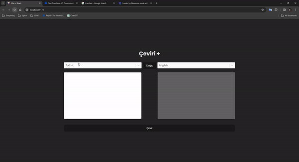

# Translate-App
I have cloned a translate app with React !!

As seen in the design, I created an application where you can translate between various languages. 
I took help from the react-select library for listing. I used Redux Toolkit for state management in this application. 

# Screen

# Libraries
- sass / react-redux / redux-toolkit / axios / react-select
